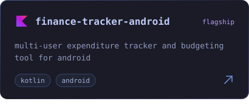
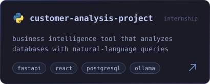
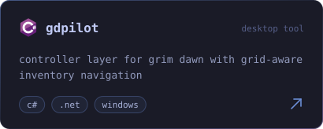
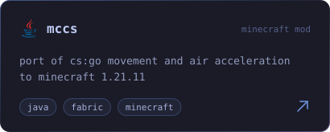

<!-- ============ HEADER ============ -->

  

 

<!-- ============ SOCIALS ============ -->

  
  

 

<!-- ============ TECH STACK ============ -->

  

  

 

<!-- ============ PROJECTS ============ -->
<!-- each row is kept on one line on purpose: whitespace between the images would break the alignment -->

  

  

  

 

<!-- ============ GITHUB STATS ============ -->

  

  

  

<!-- ============ ACTIVITY GRAPH ============ -->

  

 

<!-- ============ FOOTER ============ -->

  

