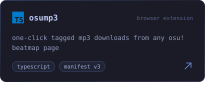
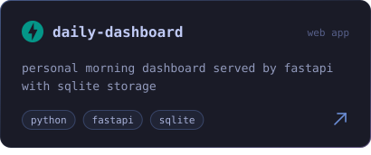

<!-- ============ HEADER ============ -->

  

 

<!-- ============ SOCIALS ============ -->

  
  

 

<!-- ============ PROJECTS ============ -->

  

  
  

  
  

 

<!-- ============ TECH STACK ============ -->

  

  

 

<!-- ============ GITHUB STATS ============ -->

  

  
  

  

  

 

<!-- ============ FOOTER ============ -->

  

